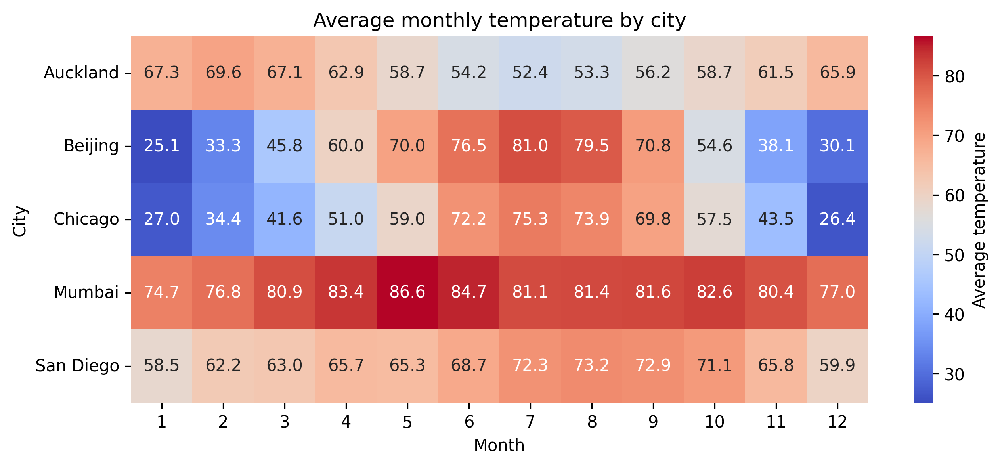
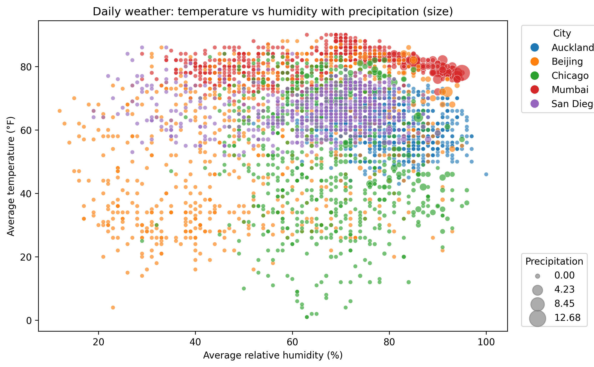
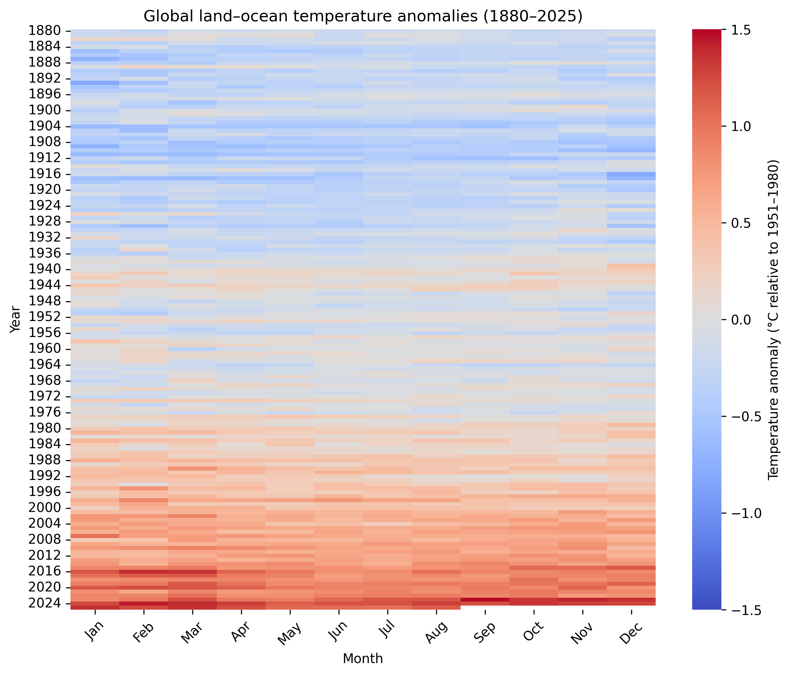
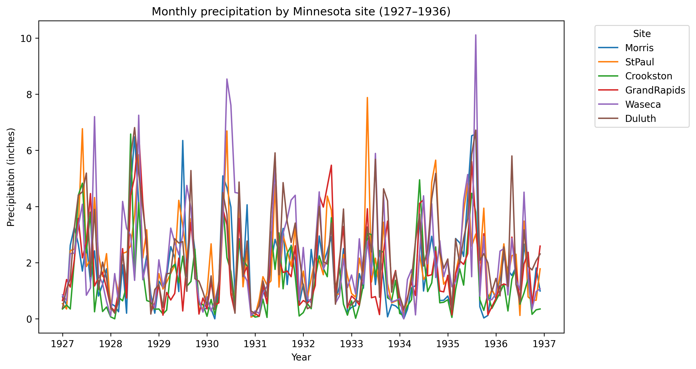

# Assignment IT5425 - Do Thanh Dat 20261103M

---

# 📊 Assignment 03 — Trực quan hóa Dữ liệu Khí hậu & Thủy văn Đa chiều

> Mã nguồn và dữ liệu nằm trong thư mục [`multi-dimensional-data-visualization/`](multi-dimensional-data-visualization/).

```text
it5425-assignment/
├── pyproject.toml   # Packages List
└── multi-dimensional-data-visualization/
    ├── data/
    │   ├── weather_data.csv
    │   ├── global_temp.csv
    │   └── minnesota_weather.csv
    ├── src/
    │   └── create_visualizations.py
    └── output/
        ├── weather_heatmap.png
        ├── weather_scatter.png
        ├── global_temp_heatmap.png
        └── minnesota_precip_line.png
```

## Các bộ dữ liệu và lý do lựa chọn

**Thời tiết hàng ngày của nhiều thành phố trên thế giới (mosaicData)** – *weather_data.csv* được trích xuất từ bộ dữ liệu `Weather` trong gói `mosaicData`. Theo tài liệu chính thức, bảng này chứa **các quan trắc thời tiết hàng ngày trong giai đoạn 2016–2017 của một số thành phố trên thế giới**, bao gồm các biến như thành phố, ngày, nhiệt độ cao nhất/trung bình/thấp nhất, điểm sương, độ ẩm, áp suất mực nước biển, tầm nhìn, tốc độ gió, lượng mưa và các hiện tượng thời tiết【209500219273106†L78-L137】. Nhiệt độ được ghi nhận bằng độ Fahrenheit (°F) và lượng mưa được cung cấp dưới dạng giá trị ký tự (ví dụ: `T` biểu thị lượng mưa vết - lượng mưa rất nhỏ không đáng kể)【209500219273106†L108-L135】. Dữ liệu được thu thập từ WeatherUnderground vào tháng 1 năm 2018【209500219273106†L140-L143】. Bộ dữ liệu này rất hấp dẫn vì nó cung cấp các giá trị hàng ngày cho nhiều biến số trên nhiều vùng khí hậu khác nhau — từ vùng nhiệt đới như Mumbai đến vùng ôn đới như Auckland và Chicago — từ đó cho phép kết hợp nhiều chiều kích dữ liệu (thành phố, thời gian, nhiệt độ, độ ẩm, lượng mưa) vào cùng một biểu đồ.

**Dị thường nhiệt độ toàn cầu trên đất liền và đại dương (NASA GISTEMP)** – *global_temp.csv* là bản sao định dạng CSV của file `GLB.Ts+dSST.csv` từ phân tích GISTEMP (v4) của NASA. Dự án GISTEMP kết hợp dữ liệu trạm khí tượng từ Mạng lưới Khí hậu Lịch sử Toàn cầu của NOAA (GHCN v4) với nhiệt độ bề mặt nước biển ERSST v5 để ước tính sự thay đổi nhiệt độ bề mặt toàn cầu【238077913597605†L30-L38】. Chỉ số dị thường (anomalies) được biểu thị tương đối so với mức trung bình của giai đoạn **1951–1980** và thể hiện mức độ sai lệch bằng độ C (°C)【57940960815465†L124-L139】. Bộ dữ liệu cung cấp các mức dị thường hàng tháng từ năm **1880–2025** và được cập nhật vào khoảng ngày 10 hàng tháng【238077913597605†L30-L38】. Các hồ sơ nhiệt độ dài hạn là nền tảng cho nghiên cứu thủy văn và biến đổi khí hậu, và độ phân giải thời gian theo tháng cho phép chúng ta trực quan hóa xu hướng ấm lên toàn cầu qua cả các năm và các mùa.

**Tóm tắt thời tiết của thử nghiệm lúa mạch Minnesota (agridat)** – *minnesota_weather.csv* lấy từ bộ dữ liệu `minnesota.barley.weather` trong gói `agridat`. Bộ dữ liệu này chứa **tóm tắt thời tiết hàng tháng từ năm 1927–1936 cho sáu địa điểm ở Minnesota**, nơi các thử nghiệm năng suất lúa mạch được tiến hành【635360545156382†L22-L59】. Các biến bao gồm tên địa điểm, năm, tháng, số ngày độ làm mát (cdd), số ngày độ sưởi ấm (hdd), lượng mưa (inch) và nhiệt độ tối thiểu/tối đa trung bình hàng ngày (°F)【635360545156382†L22-L59】. Dữ liệu được trích xuất từ hồ sơ của Trung tâm Dữ liệu Khí hậu Quốc gia Mỹ【635360545156382†L63-L86】. Bộ dữ liệu này được chọn nhằm đối chiếu góc nhìn toàn cầu với khí hậu khu vực địa phương trong vòng một thập kỷ và khám phá sự biến động của lượng mưa giữa các địa điểm gần nhau.

## 🛠️ Trực quan hóa dữ liệu

Script `create_visualizations.py` tải các file CSV này bằng thư viện `pandas` và sau đó xây dựng các biểu đồ trực quan hóa sau:

### 1. 🌡️ Nhiệt độ trung bình hàng tháng theo thành phố (Bản đồ nhiệt - Heatmap)



**Giải thích mã nguồn** (`plot_weather_heatmap`):

```python
monthly = df.groupby(["city", "month"], as_index=False)["avg_temp"].mean()
matrix  = monthly.pivot(index="city", columns="month", values="avg_temp")
matrix  = matrix.reindex(sorted(matrix.columns), axis=1)
sns.heatmap(matrix, cmap="coolwarm", annot=True, fmt=".1f",
            cbar_kws={"label": "Average temperature"})
```

- `groupby(["city", "month"]).mean()` gộp các quan trắc hàng ngày thành **một giá trị nhiệt độ trung bình cho mỗi cặp (thành phố, tháng)**, giảm hàng nghìn dòng xuống còn một bảng tóm tắt.
- `pivot(...)` xoay bảng dài thành **ma trận 2 chiều** với hàng là thành phố, cột là tháng và ô là nhiệt độ.
- `reindex(sorted(...))` đảm bảo các cột tháng nằm đúng thứ tự lịch (1 → 12).
- `sns.heatmap` ánh xạ giá trị thành màu: bảng màu phân kỳ `coolwarm` (đỏ = nóng, xanh = lạnh), `annot=True, fmt=".1f"` in con số tới một chữ số thập phân lên từng ô, và `cbar_kws` gắn nhãn cho thanh màu.

**Phân tích:** Đọc theo từng hàng, biểu đồ bộc lộ **biên độ dao động mùa** rất khác nhau giữa các đới khí hậu: Bắc Kinh và Chicago chuyển từ xanh đậm vào mùa đông (~25–35 °F) sang đỏ vào mùa hè (~80 °F) — chênh lệch hơn 45 °F, đặc trưng khí hậu lục địa; ngược lại Mumbai gần như đỏ quanh năm (>74 °F) còn Auckland và San Diego giữ tông màu trung tính ổn định. Nói cách khác, *vị trí địa lý quyết định không chỉ mức nhiệt mà còn cả mức độ biến động nhiệt theo mùa*.

### 2. 🌬️💧 Nhiệt độ hàng ngày so với Độ ẩm tích hợp Lượng mưa (Biểu đồ phân tán - Scatter Plot)



**Giải thích mã nguồn** (`plot_weather_scatter`):

```python
df["precip"] = pd.to_numeric(df["precip"], errors="coerce").fillna(0.0)
sns.scatterplot(data=df, x="avg_humidity", y="avg_temp",
                hue="city", size="precip", sizes=(20, 300),
                alpha=0.65, legend=False)
# hai chú giải tùy biến: màu (thành phố) và kích thước (lượng mưa)
```

- Cột `precip` chứa giá trị ký tự như `"T"` (lượng mưa vết); `pd.to_numeric(..., errors="coerce")` ép các giá trị không phải số thành `NaN`, rồi `fillna(0.0)` quy chúng về 0 để có thể dùng làm kích thước điểm.
- `sns.scatterplot` mã hóa **bốn chiều dữ liệu trên một mặt phẳng**: trục x là độ ẩm, trục y là nhiệt độ, `hue="city"` gán màu theo thành phố và `size="precip"` gán đường kính điểm theo lượng mưa (`sizes=(20, 300)` đặt khoảng kích thước, `alpha=0.65` tạo độ trong suốt để thấy các điểm chồng nhau).
- `legend=False` tắt chú giải mặc định; sau đó mã tự dựng **hai chú giải riêng** (một cho màu thành phố bằng `Line2D`, một cho kích thước lượng mưa bằng `np.interp`) và đặt ngoài vùng vẽ để không che dữ liệu.

**Phân tích:** Đám mây điểm cho thấy mối quan hệ nhiệt độ–độ ẩm **không tuyến tính mà phân cụm theo thành phố**: Mumbai (góc trên phải) gom thành cụm vừa nóng vừa ẩm, còn Chicago/Bắc Kinh trải dài xuống vùng nhiệt độ thấp. Đáng chú ý, các điểm lớn nhất (mưa nhiều) hầu như tập trung ở vùng độ ẩm cao (>80%), xác nhận trực giác rằng *mưa lớn đi kèm độ ẩm cao*, nhưng độ ẩm cao thì không nhất thiết có mưa — nhiều điểm nhỏ (lượng mưa ~0) vẫn nằm ở dải độ ẩm 80–100%.

### 3. 🔥🧊 Bản đồ nhiệt dị thường nhiệt độ toàn cầu (Global temperature anomalies heatmap)



**Giải thích mã nguồn** (`plot_global_temp_heatmap`):

```python
long_df = df.melt(id_vars="Year", value_vars=MONTH_ABBR,
                  var_name="Month", value_name="Anomaly")
long_df["MonthNum"] = long_df["Month"].map(month_to_num)
matrix = long_df.pivot(index="Year", columns="MonthNum",
                       values="Anomaly").sort_index()
sns.heatmap(matrix, cmap="coolwarm", vmin=-1.5, vmax=1.5,
            cbar_kws={"label": "Temperature anomaly (°C ...)"})
```

- Dữ liệu GISTEMP ở dạng **rộng** (mỗi tháng là một cột). `melt(...)` chuyển nó về dạng **dài** với một dòng cho mỗi (năm, tháng); việc tiền xử lý ở `main()` đã thay `***` bằng `NA` để các ô thiếu hiển thị trống.
- `map(month_to_num)` đổi `"Jan"…"Dec"` thành số 1–12 để sắp xếp đúng theo lịch, rồi `pivot(...).sort_index()` dựng lại ma trận Năm × Tháng theo thứ tự năm tăng dần.
- `vmin=-1.5, vmax=1.5` **cố định thang màu** quanh điểm 0 (mốc cơ sở 1951–1980), nhờ đó màu xanh/đỏ so sánh được giữa mọi năm; trục x được ghi lại bằng tên viết tắt của tháng và xoay 45°.

**Phân tích:** Vì thang màu được neo cố định, sự dịch chuyển màu theo trục dọc trở thành **dấu vân tay của biến đổi khí hậu**: nửa trên của ma trận (1880–1950) gần như toàn xanh (mát hơn mốc cơ sở), trong khi từ khoảng 1980 trở xuống đỏ dần và những năm gần đây (2016, 2020, 2024) đỏ đậm ở mọi tháng. Điều quan trọng là *xu hướng ấm lên hiện diện đồng đều trên cả 12 cột* — đây là sự dịch chuyển nền của toàn hệ thống, không phải hiện tượng của riêng một mùa.

### 4. 🌧️ Lượng mưa hàng tháng theo địa điểm ở Minnesota (Biểu đồ đường - Line Chart)



**Giải thích mã nguồn** (`plot_minnesota_precip_line`):

```python
df["date"] = pd.to_datetime(dict(year=df["year"], month=df["mo"], day=1))
sns.lineplot(data=df, x="date", y="precip", hue="site")
ax.legend(bbox_to_anchor=(1.05, 1), loc="upper left", title="Site")
```

- `pd.to_datetime(dict(...))` ghép cột `year` và `mo` (đặt `day=1`) thành **một trục thời gian liên tục**, giúp matplotlib giãn cách các điểm theo đúng khoảng cách thời gian thực thay vì xem chúng như nhãn rời rạc.
- `sns.lineplot(..., hue="site")` vẽ **một đường riêng cho mỗi địa điểm** với màu khác nhau, nối các giá trị lượng mưa theo thứ tự thời gian để làm nổi bật xu hướng và chu kỳ.
- `ax.legend(bbox_to_anchor=(1.05, 1), ...)` đẩy chú giải ra **ngoài khung vẽ** để sáu đường chồng nhau không bị che.

**Phân tích:** Cả sáu đường dao động **đồng pha** với các đỉnh lặp lại đều đặn vào các tháng mùa hè (6–8) và đáy vào mùa đông — một tín hiệu mùa vụ mạnh đặc trưng cho khí hậu lục địa của Minnesota. Tuy nhiên *biên độ* lại khác nhau giữa các trạm (Waseca và St. Paul thường vọt lên 8–10 inch trong khi Morris/Crookston thấp hơn rõ rệt), cho thấy dù chịu chung một nhịp khí hậu khu vực, lượng mưa cực đoan vẫn mang tính cục bộ rõ nét.

## 💡 Lựa chọn, thách thức và hướng phát triển

### 🎨 Tại sao lại chọn các hình thức trực quan hóa này?

Mục tiêu chính là minh họa các quy luật đa chiều bằng các đồ họa đơn giản nhưng giàu thông tin. Bản đồ nhiệt (heatmap) được chọn cho trực quan hóa thứ nhất và thứ ba vì chúng tóm tắt một cách gọn gàng hai chiều phân loại (thành phố × tháng hoặc năm × tháng) và mã hóa một biến định lượng bằng màu sắc; điều này làm cho chúng trở nên lý tưởng để xác định chu kỳ mùa và xu hướng dài hạn. Biểu đồ phân tán (scatter plot) cho phép chúng ta mã hóa ba biến số — nhiệt độ, độ ẩm và lượng mưa — trong một khung hình duy nhất bằng cách ánh xạ lượng mưa vào kích thước điểm và thành phố vào màu sắc điểm. Biểu đồ đường nhấn mạnh tính liên tục theo thời gian và cho phép so sánh nhiều địa điểm trên cùng một thang đo. Việc sử dụng `seaborn` đã đơn giản hóa việc xây dựng các biểu đồ này, trong khi `pandas` xử lý biến đổi dữ liệu một cách hiệu quả.

### 🔭 Những điểm có thể cải thiện?

Có một số hướng để mở rộng dự án này. Đối với dữ liệu thời tiết hàng ngày, chúng ta có thể chuyển đổi nhất quán tất cả các đơn vị nhiệt độ và lượng mưa, chẳng hạn như biểu thị nhiệt độ bằng °C để khớp với dị thường GISTEMP và tính toán cụ thể lượng mưa từ các mã `T` (lượng mưa vết). Các công cụ tương tác như `plotly` hoặc `Altair` có thể cho phép người dùng di chuột qua các điểm dữ liệu cá nhân, lọc theo thành phố hoặc mùa, và khám phá chi tiết các ngày cụ thể. Khi làm việc với bộ dữ liệu GISTEMP, chúng ta mới chỉ giới hạn ở bản đồ nhiệt đơn giản; các kỹ thuật tiên tiến hơn (ví dụ: phân tích thành phần chính PCA hoặc phân cụm) có thể được sử dụng để nhóm các năm có mô hình dị thường tương tự nhau và kiểm tra đóng góp của từng vùng vào tín hiệu toàn cầu. Đối với dữ liệu lúa mạch Minnesota, sẽ rất thú vị nếu kết hợp tóm tắt thời tiết với dữ liệu năng suất để khám phá xem các ngày độ làm mát và sưởi ấm ảnh hưởng như thế nào đến năng suất lúa mạch; điều này đòi hỏi phải liên kết (join) với bộ dữ liệu `minnesota.barley.yield` và xây dựng các mô hình hồi quy. Cuối cùng, việc phát triển một trang tổng quan (dashboard) trên nền tảng web liên kết các bộ dữ liệu này có thể cung cấp một cái nhìn tích hợp về các mô hình thời tiết và khí hậu trên nhiều quy mô.

## 🏗️ Cách chạy dự án

Dự án sử dụng [`uv`](https://docs.astral.sh/uv/) để quản lý môi trường ảo và các thư viện phụ thuộc (`pandas`, `matplotlib`, `seaborn`, `numpy`) được khai báo trong `pyproject.toml`.

1. Cài đặt thư viện và tạo môi trường ảo (chạy từ thư mục gốc của kho lưu trữ):
   ```bash
   uv sync
   ```
2. Chạy script tạo biểu đồ:
   ```bash
   uv run python multi-dimensional-data-visualization/src/create_visualizations.py
   ```
   Script sẽ tải các tệp dữ liệu từ thư mục `data/` và ghi bốn tệp hình ảnh vào thư mục `output/`. Mỗi biểu đồ được lưu ở độ phân giải 300 dpi để phù hợp chèn vào các báo cáo.
3. Xem các biểu đồ trong thư mục `multi-dimensional-data-visualization/output/`. Các phần mô tả chi tiết ở trên đã tóm tắt những phát hiện chính. Bạn có thể thử nghiệm với các loại biểu đồ khác hoặc sửa đổi script để khám phá các biến số khác.

---

**Lưu ý về nguồn trích dẫn:** Mô tả về các bộ dữ liệu `Weather` và `minnesota.barley.weather` được lấy từ tài liệu chính thức của các gói R tương ứng, trong đó làm rõ các định nghĩa biến số và nguồn dữ liệu【209500219273106†L78-L137】【635360545156382†L22-L59】. Thông tin về bộ dữ liệu GISTEMP — bao gồm sự kết hợp giữa dữ liệu trạm khí tượng GHCN v4 với nhiệt độ bề mặt đại dương ERSST v5 và mốc cơ sở 1951–1980 — được trích xuất từ tài liệu của NASA và NOAA【238077913597605†L30-L38】【57940960815465†L124-L139】. Những nguồn tài liệu này giải thích xuất xứ và cách diễn giải các bộ dữ liệu được sử dụng tại đây.
